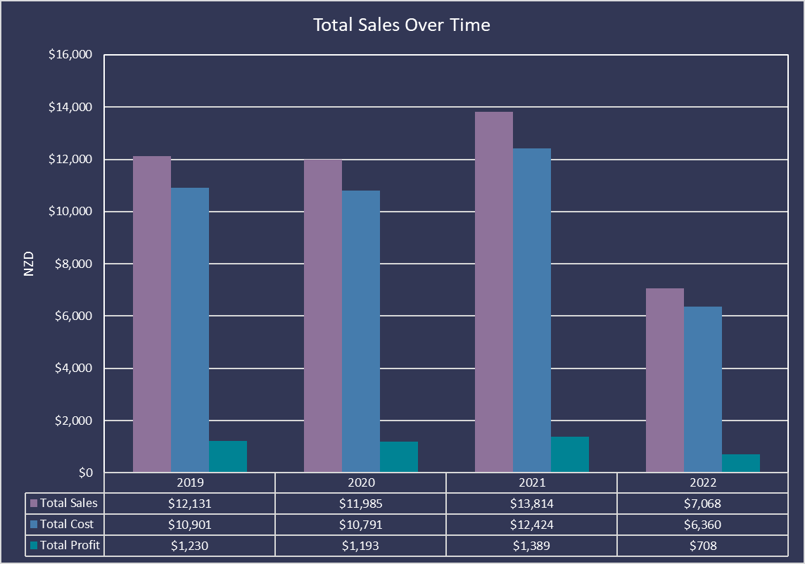

# Coffee Bean Store Data Analysis

## Project Background

The Coffee Bean Store, established in 2019, is an e-commerce company that sells coffee beans via its website. This report details the sales performance of Coffee Bean from 2019 to 2022, focusing on total sales, costs, profits, customer demographics, and the impact of loyalty programs. The objective is to identify trends and insights that can guide the development of future business strategies.

Insights and recommendations are provided on the following key areas:
- **Sales Trends Analysis:** Evaluation of historical sales patterns, focusing on revenue and order volume
- **Product Level Performance:** An analysis of product lines, understanding their impact on sales.
- **Loyalty Program Success:** An assessment of the loyalty program on customer retention and sales.
- **Global Comparisons:** An evaluation of sales and orders by country and customers.

An interactive Excel dashboard can be downloaded [here](data-analysis/coffee-bean-store-data-analysis.xlsx)

## Data Structure & Initial Checks

Coffee Bean Store’s database structure consists of three tables: Orders, Customers and Products. Prior to beginning the analysis, a variety of checks were conducted for quality control. The data was cleaned, organized, and prepared including familiarization with the datasets. 

## Executive Summary

### Overview of Findings

Fluctuations in total sales can be observed over the years since the company’s inception in 2019. Between 2019 and 2021, key performance indicators have shown that, order volume increase by 5%, total sales increased from 27% to 31% and profit was 27%, 26% and 31% respectively. 

Sales distribution reveals that the United States overwhelmingly dominates sales figures, accounting for $35,476. The peak engagement occurred in 2021, with 312 total orders. The highest sales recorded was $4,690 from the "Light Excelsa" category, with 0.5 kg being the most popular size among customers.

Sales data for 2022 is available only until August, meaning business year remains in progress.

## Sales Trends

### Total Sales Over Time

A significant fluctuation in total sales can be observed over the years. While there was growth between 2019 to 2021, there is a notable decline registered in 2022 as the year is still ongoing.
- **2019 - 2020**: Sales declined slightly to $11,985, despite a rise in profits due to lower cost in 2020.
- **2021**: A promising rebound in sales to $13,814 reflects a growing demand.
- **2022**: A notable decline in total sales to $7,068, indicating on going year for the business. 

### Total Orders by Year

The total number of orders gives insight into customer engagement. Orders peaked in 2021 but as expected significantly low in 2022. 
- **2019**: Recorded 259 orders.
- **2020**: A decrease in orders to 263.
- **2021**: An increase to 312 orders, indicating rising customer trust and satisfaction.
- **2022**: Recorded 166 order till date and the year is incomplete. 

### Sales by Country

Sales distribution reveals that the United States overwhelmingly dominates sales figures, accounting for $35,476. Other countries such as Ireland account for $6,719 and the United Kingdom for $2,802 following with much lower figures. This insight indicates the potential for expansion into other markets and countries.

## Product Performance

Excelsa is the top selling coffee beans, followed by Liberica, Arabica and Robusta. With regards to category, light is highly preferred by the customers, followed by medium and dark. 
The highest sales recorded was $4,690 from the "Light Excelsa" category, while the lowest was $2,603 from the "Light Robust" category.

Most popular size is 0.5 kg with 268 orders. Whereas, least popular size is 1.0 kg with 236 orders.

## Customers & Impact of Loyalty Programs

The data reveals a diverse customer base with the top customer, Terri Farra, accounting for a significant portion of sales. Targeting retention strategies could be beneficial.

The peak engagement occurred in 2021, with 312 total orders. 179 orders were placed by non-loyalty card holder which is about 57%.
There's a noticeable decline in the number of orders from cardholders in 2022 as expected

## Recommendations

Based on the uncovered insights, the following recommendations have been provided.

- **Target Promotions**: Focus on promoting high-margin coffee types particularly in countries with the highest revenue. Develop targeted marketing strategies to enhance brand visibility and boost sales in underrepresented markets.
- **Expand Market Reach**: Investigate strategies to capture market share in Ireland and the UK, where sales are currently lower.
- **Dynamic Pricing**: Implement dynamic pricing based on sales performance to maximize profit margins.
- **Focus on Popular Sizes**: Maintaining adequate stock and promotional strategies for the most popular product size (0.5 kg) can maximize sales and customer satisfaction.
- **Customer Engagement & Loyalty Program**: Use customer data to curate personalized marketing strategies. Given the reliance on specific top customers, consider introducing targeted loyalty programs.
- **Data-Driven Decision Making**: Carry out comprehensive assessments on a routine basis to guide future planning and investment strategies.

## Assumptions and Caveats
Throughout the analysis, multiple assumptions were made to manage challenges with the data. These assumptions and caveats are noted below:
- According to the dataset, sales data for 2022 is available only until August. Therefore, it has been assumed that the business year remains in progress.
